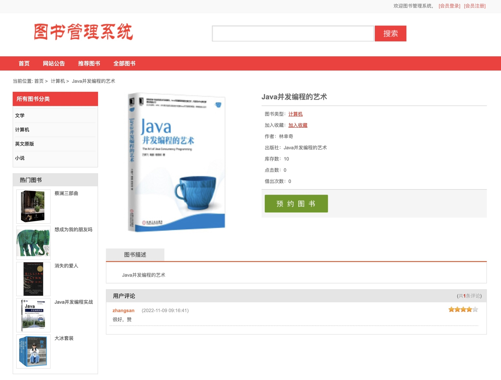
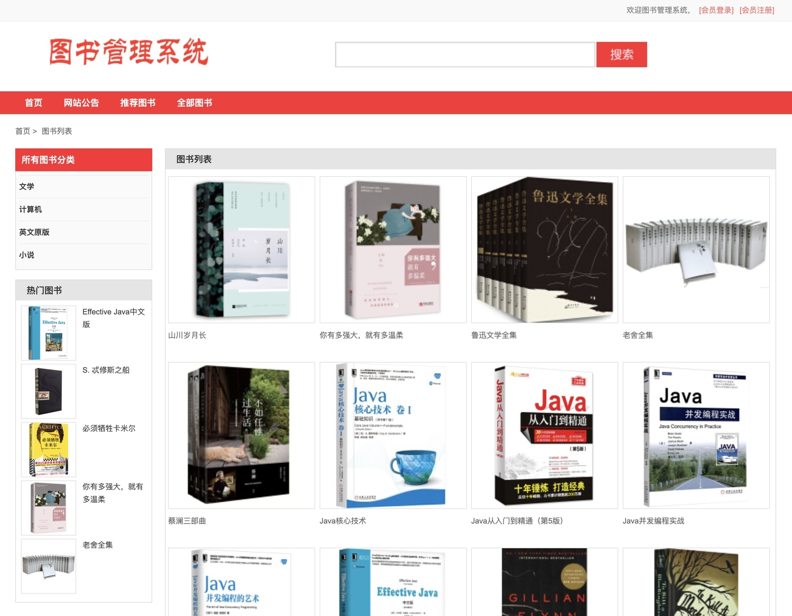
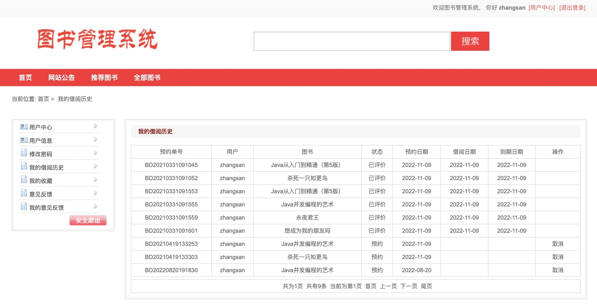
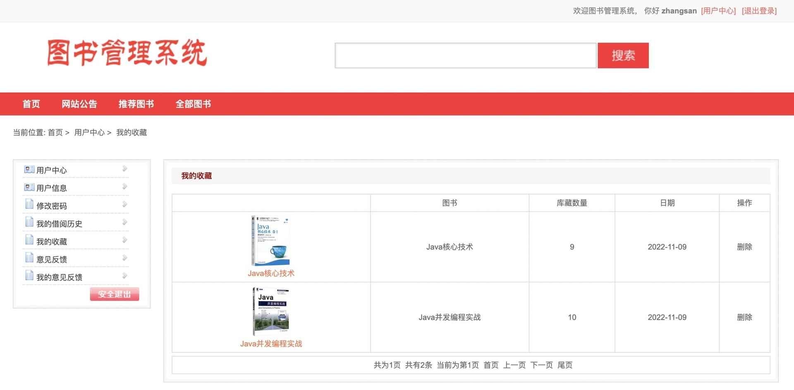
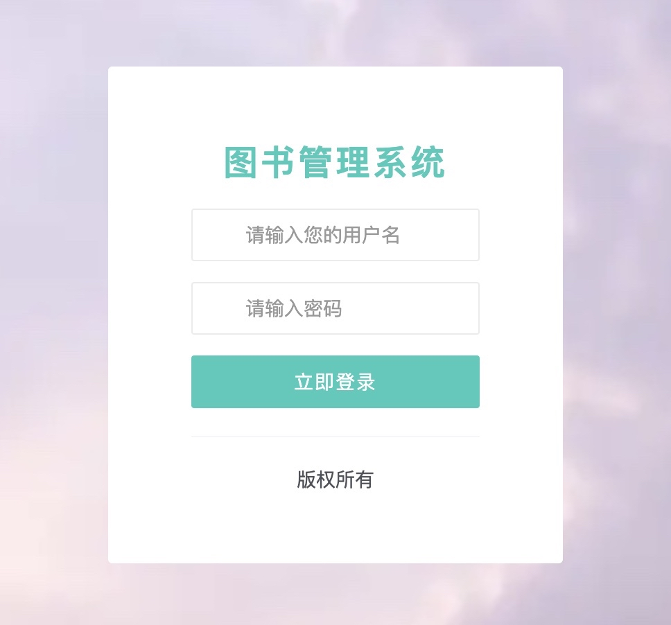
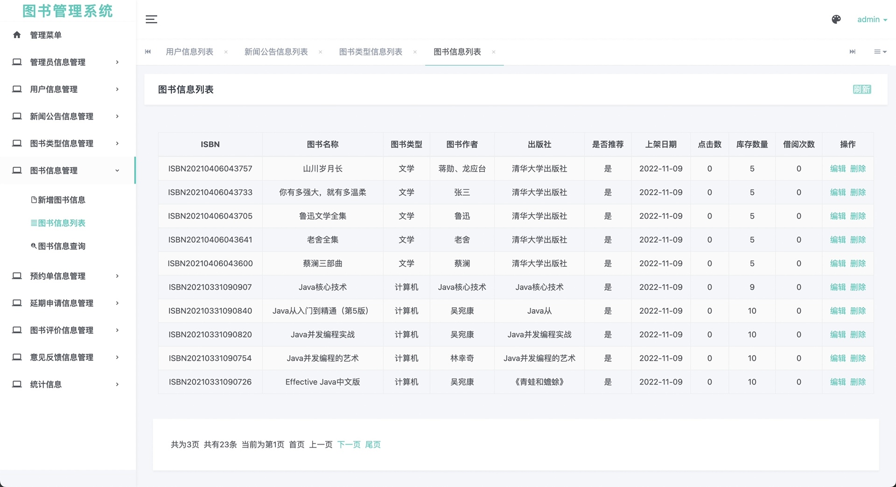
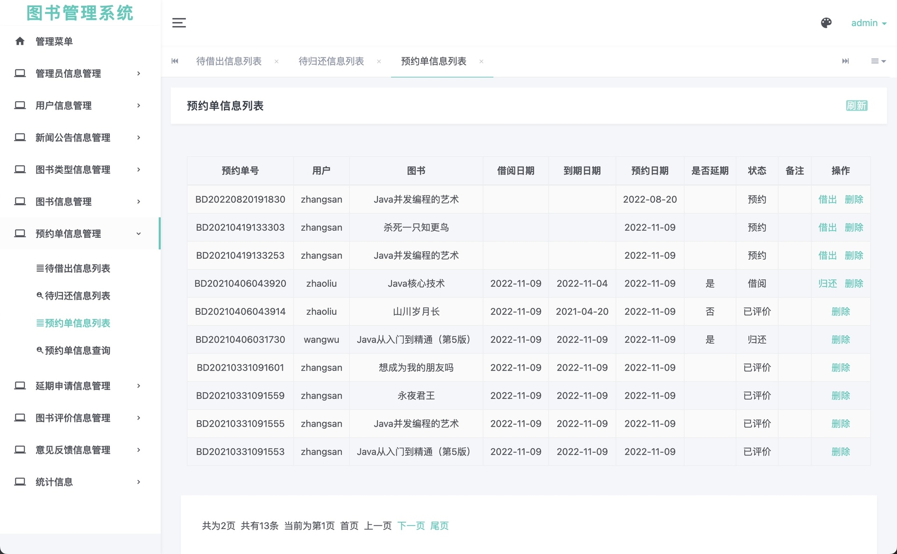
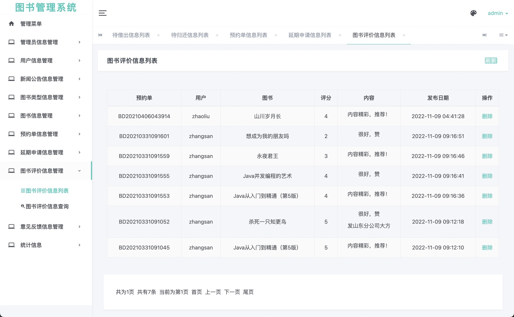

## 基于SpringBoot的图书管理系统

###  获取sql数据库文件: 从戎源码网 (https://armycodes.com/) QQ: 386869957 QQ群: 377586148
###  所有系统地址: (https://github.com/YuLin-Coder/AllProjectCatalog) 
###  所有项目以及源代码本人均调试运行无问题 可支持远程安装部署调试、定制修改、代码讲解

## 项目介绍
基于SpringBoot的图书管理系统，主要包含两种角色：读者和管理员，主要功能如下

读者只能对个人信息的查阅、修改，图书的查询，而管理员则可以进行图书信息及借阅信息的管理。

（1）系统登录。分为普通读者登录和管理员登录。
（2）系统管理。系统管理包括管理员设置，以及图书类别设置。管理员设置包括管理员信息的设置以及密码的设置。图书类别的设置只有管理员才可以对他进行新增，修改和删除。
（3）图书管理。包括图书信息管理，图书信息查询。只有管理员才可以对图书进行管理，图书查询是帮助读者方便查找图书信息。
（4）读者管理。读者管理包括读者信息管理，以及读者信息的查询。读者信息查询可以根据读者的姓名和编号进行查询。读者信息管理只对管理员有用，只有管理员可以添加读者，修改和删除读者的信息。
（5）图书借阅管理。图书借阅包括图书的借阅，归还以及续借。图书的借阅以及归还只对管理员起作用，只有通过管理员才可以进行图书的借阅以及归还。读者只能对图书进行续借的操作。

## 项目技术
- 编程语言：Java
- 数据库：MySQL
- 项目管理工具：Maven
- 前端技术：HTML、CSS、JavaScript、jsp
- 后端技术：Spring、SpringMVC、MyBatis

## 运行环境
- JDK版本：JDK1.8及以上
- 开发工具：IDEA、Ecplise、Myecplise都可以
- 数据库: MySQL5.7及以上
- Maven：maven3.0及以上

## 运行截图

